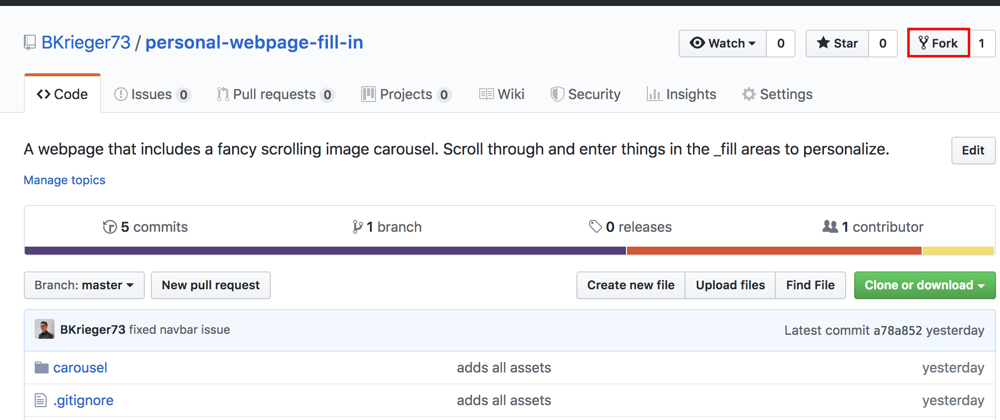
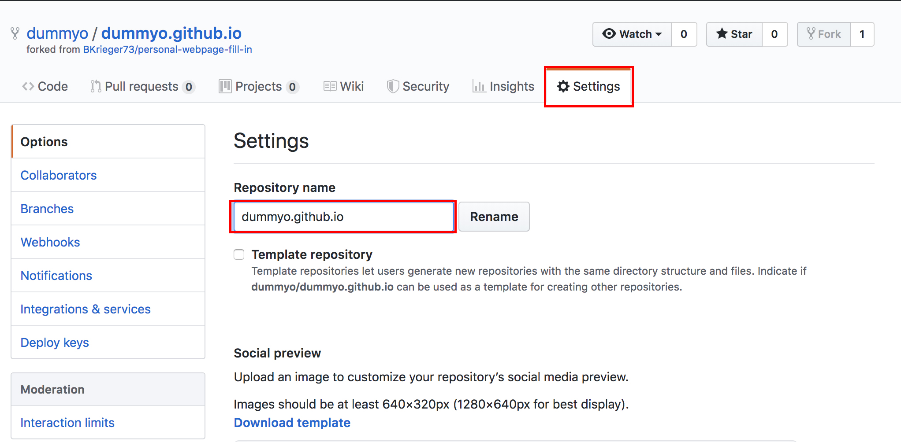
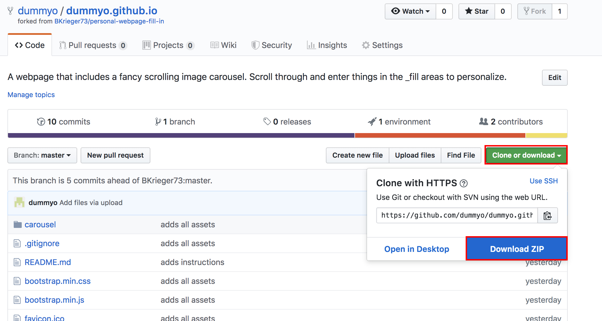
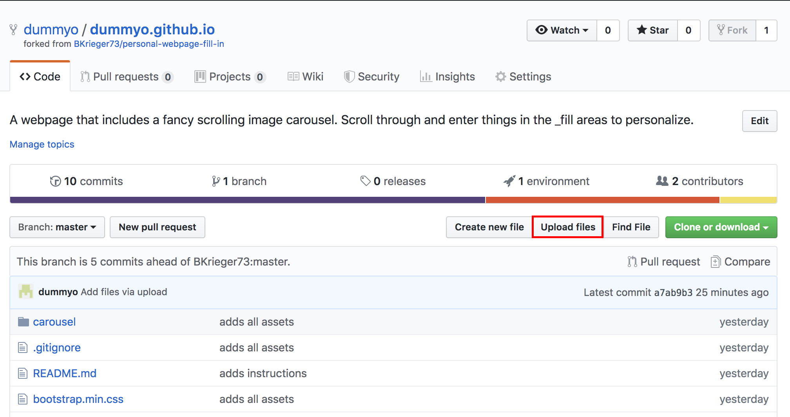
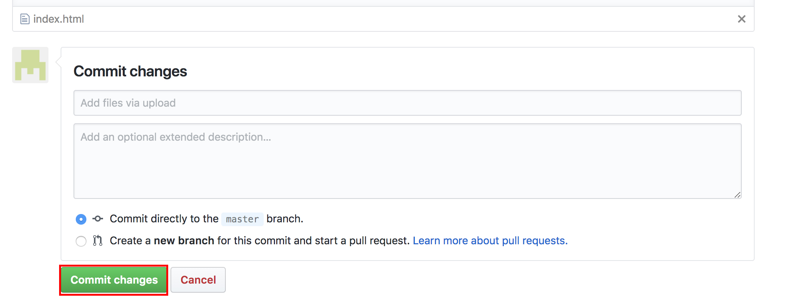

# personal-webpage-fill-in

This project is a template for creating a basic static webpage to describe who you are to the world.

Using GitHub pages we can easily host this webpage for anyone to view.

## Instructions

In order to follow these instructions you must have a GitHub (https://github.com/) account as well as a text editor. The instructions assume you are using Atom. Download here: https://atom.io/

### Step 1: Get the code
Go to https://github.com/BKrieger73/personal-webpage-fill-in and click fork.

This will copy the repo to your own github account. It takes a few seconds to complete.

### Step 2: Rename your repo for GitHub pages.
In your new copy of the repo go to the settings tab and change the name so that it is called `<your username>.github.io` where you replace `<your username>` with your username (including the `<>`). Click the rename button after you filled in your new Repository Name.

This new name will allow GitHub pages to find your repo automatically. You will be able to view your webpage at `https://youruser.github.io/` It will take at least 10 minutes for GitHub to make your webpage available and could take as long as 30 minutes. Subsequent updates to your code should propagate in a matter of minutes.

### Step 3: Customizing the site
Back on the `Code` tab, click on the green `clone or download` button. Then, click download zip.

In your finder(mac) or explorer(windows) unzip the files. Open your Atom editor click `File => Add Project Folder...` Find your unzipped folder and click `Open`

In Atom you will see all of the project files on the left hand pane. Click the `index.html` file. From your finder/explorer open this same file in Chrome. You can open in it any browser, but Chrome is the best.

In atom, you can make edits to `index.html` and view them in the browser.

### Step 4: Let's make our first edit.
In Atom, using your keyboard hit the keys CMD + F (CTRL + F for windows) to use the search feature. Type in `_fill jon snow`. The editor will find this text. Type over that text with your own name. Save the file (CMD + S on the keyboard or CTRL + S for windows). Go back to Chrome (CMD + Tab on the key board or ALT + Tab for windows). Refresh the page (CMD + R or CTRL + R for windows).

You should see in the upper left of the webpage where it used to read `_fill Jon Snow` it should now display your name.

Using the search in Atom you can look for all of the different instances of `_fill` in the file, and see where they appear in the webpage on Chrome. Replace these with your own information and use Chrome to see how they look.

### Step 5: Deploying our changes.
Back on your GitHub repo, click `Upload files`

Add your `index.html` file. Scroll to the bottom of the page and click `Commit changes`

After several minutes you should see the changes you uploaded reflected on `https://youruser.github.io/`

### Step 6: Changing images
There are 5 images in this project.

There are the 3 large carousel images:
* carousel/carousel1.jpg
* carousel/carousel2.jpg
* carousel/carousel3.jpg

A profile picture: `profile.jpg`
And a favicon: `favicon.ico` (https://favicon.io/ is a handy tool for generating favicons. (favicons are the cool little images that appear on the left hand side of the browser tab(the favicon for this website is currently a :D emoji)))

By replacing these images with your own images they will appear in the same way as the originals. Just make sure you use the same exact name as they are currently.

`profile.jpg` is not the same as `profile.JPG` or `profile.jpeg`.

Once you are happy with your new images and they look the way you want them to, upload them using the same process from Step 5. Be sure to upload the carousel images in the carousel directory!
