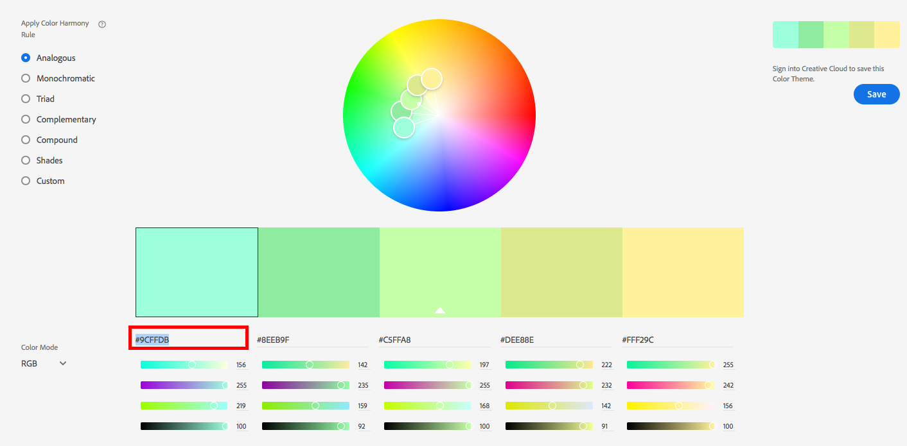

# personal-webpage-fill-in

This project is a template for creating a basic static webpage to describe who you are to the world.

Using GitHub pages we can easily host this webpage for anyone to view.

## Instructions

In order to follow these instructions you must have a GitHub (https://github.com/) account as well as a text editor. The instructions assume you are using a text editor called Atom. Download here: https://atom.io/

### Step 1: Get the code
GitHub stores code in repositories. This tutorial calls them repo(s) as an abbreviation.

Go to this repo https://github.com/BKrieger73/personal-webpage-fill-in in a new tab and click fork. (See the screenshot below)


This will copy the repo to your own github account. It takes a few seconds to complete.


### Step 2: Rename your repo for GitHub pages.
In your new copy of the repo go to the settings tab and change the name so that it is called `<your username>.github.io` where you replace `<your username>` with your username (including the `<>`). Click the rename button after you filled in your new Repository Name.


This new name will allow GitHub pages to find your repo automatically. You will be able to view your webpage at `https://youruser.github.io/` It will take at least 10 minutes for GitHub to make your webpage available and could take as long as 30 minutes. Subsequent updates to your code should propagate in a matter of minutes.

### Step 3: Customizing the site
Back on the `Code` tab, click on the green `clone or download` button. Then, click download zip.


1. In your finder(mac) or explorer(windows) unzip the files.
2. Open your Atom editor. If this is your first time opening Atom, there will be extra tabs. Close these extra tabs.
3. Click `File => Add Project Folder...` Find your unzipped folder and click `Open`. Atom may prompt you about installing git command line tools, if you see this prompt click `Not Now`.

In Atom you will see all of the project files on the left hand pane.

1. Click the `index.html` file.
2. From your finder/explorer open this same file in Chrome. You can open in it any browser, but Chrome is the best.
3. In atom, you can make edits to `index.html` and view them in the browser.

### Step 4: Let's make our first edit.
1. In Atom, using your keyboard hit the keys CMD + F (CTRL + F for windows) to use the search feature.
2. Type in `_fill jon snow`. The editor will find this text.
3. Type over that text with your own name. Save the file (CMD + S on the keyboard or CTRL + S for windows).
4. Go back to Chrome (CMD + Tab on the key board or ALT + Tab for windows).
5. Refresh the page (CMD + R or CTRL + R for windows).

You should see in the upper left of the webpage where it used to read `_fill Jon Snow` it should now display your name.

Using the search in Atom you can look for all of the different instances of `_fill` in the file, and see where they appear in the webpage on Chrome. Replace these with your own information and use Chrome to see how they look.

### Step 5: Changing images
There are 5 images in this project.

There are the 3 large carousel images which are the first thing you see when you go to your webpage, currently containing images from Game of Thrones:
* carousel/carousel1.jpg
* carousel/carousel2.jpg
* carousel/carousel3.jpg

To replace these images, copy them to the carousel folder in your finder and rename the files `carousel1.jpg`, `carousel2.jpg`, and `carousel3.jpg` respectively. (Lowercase jpg)

A profile picture: `profile.jpg`
And a favicon: `favicon.ico` (https://favicon.io/ is a handy tool for generating favicons. (favicons are the cool little images that appear on the left hand side of the browser tab(the favicon for this website is currently a :D emoji)))

When replacing `profile.jpg` and `favicon.ico` make sure they go in the same directory as the `index.html`.

By replacing these images with your own images they will appear in the same way as the originals. Just make sure you use the same exact name as they are currently.

`profile.jpg` is not the same as `profile.JPG` or `profile.jpeg`.

Once you are happy with your new images and they look the way you want them to, upload them using the same process from Step 5. Be sure to upload the carousel images in the carousel directory!

### Step 7: Changing the color of the navbar
We are able to easily change the color of the navbar to better match the images in your page.

First we have to pick a color. Go to this webpage: https://color.adobe.com/create/color-wheel/

Play around until you have a color you like. Copy the hex code below the color swatch.


Replace the key word `green` in the `index.css` file at lines 2 and 3, such that it reads like:
```
.navbar{
  background-color: #9CFFDB !important; /*_fill*/
  border-color: #9CFFDB;
}
```
View the new navbar color by refreshing your webpage index.html in the browser.

### Step 8: Playing with HTML
So far we have not yet actually written any HTML.

Add a `<title>...</title>` to change the name that appears on the browser tab.

Add additional bullet points to your lists by adding more <`li>...</li>`(li=list item). And remove them by backspacing `<li></li>` blocks.

You can change your bullet lists to numbered lists by changing`<ul>...</ul>` (ul=unordered list) to `<ol>..</ol>` (ol=ordered lists)

Learn more about how to update and change your html here:

### Step 9: Deploying our changes
Back on your GitHub repo, click `Upload files`


Add your `index.html` file from your finder/explorer. Scroll to the bottom of the page and click `Commit changes`


After several minutes you should see the changes you uploaded reflected on `https://youruser.github.io/`

## Credits.
This webpage is based on https://tyleragreen.com/
